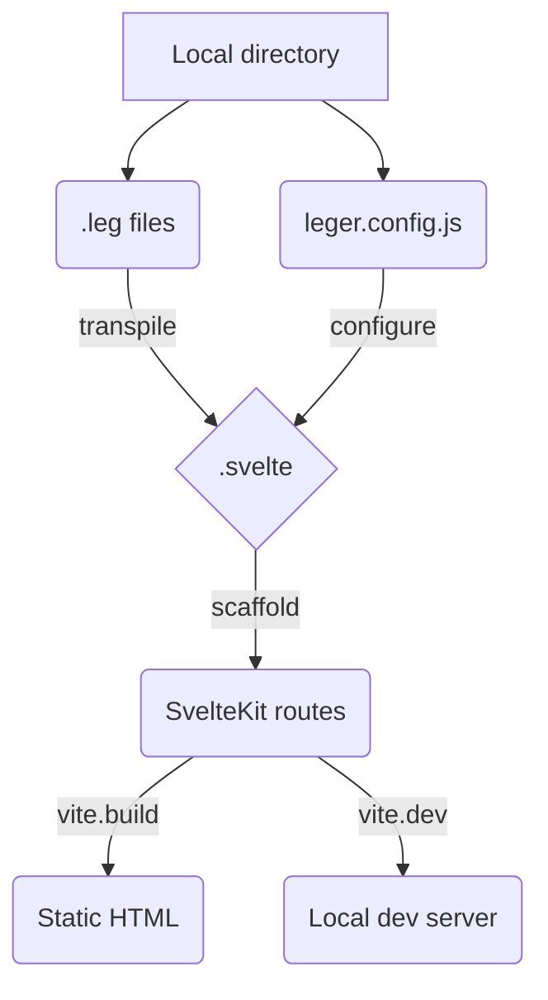

# Léger

Lightweight Static Site Generator (SSG) built with Svelte &amp; Vite


## Target transpiling pipeline



## Todo

- [x] add proper scss
- [ ] more components
- [ ] front-matter support
- [ ] markdown support
- [ ] custom svelte support
- [ ] mixin support
- [ ] better parsing
  - [ ] allow nested trailing text
- [ ] add cli options (in/out)
  - [ ] from cli
  - [ ] from leger.config.js
- [ ] Test `build` and `dev` a bit more
  - [ ] It would be best to use vite.build() and vite.createServer()
  - [ ] We can make `.leg` parsing and svelteKit project scaffolding as a vite-plugin

## Example `.leg` file

```jade
section(columns="2")
    text(size="large") This is awesome
    text(size="small") ... and this might be too small
button() Sign up
```

...would generate

```sveltehtml
<Section columns="2">
    <Text size="large">This is awesome</Text>
    <Text size="small">... and this might be too small</Text>
</Section>
<Button>Sign up</Button>
```
