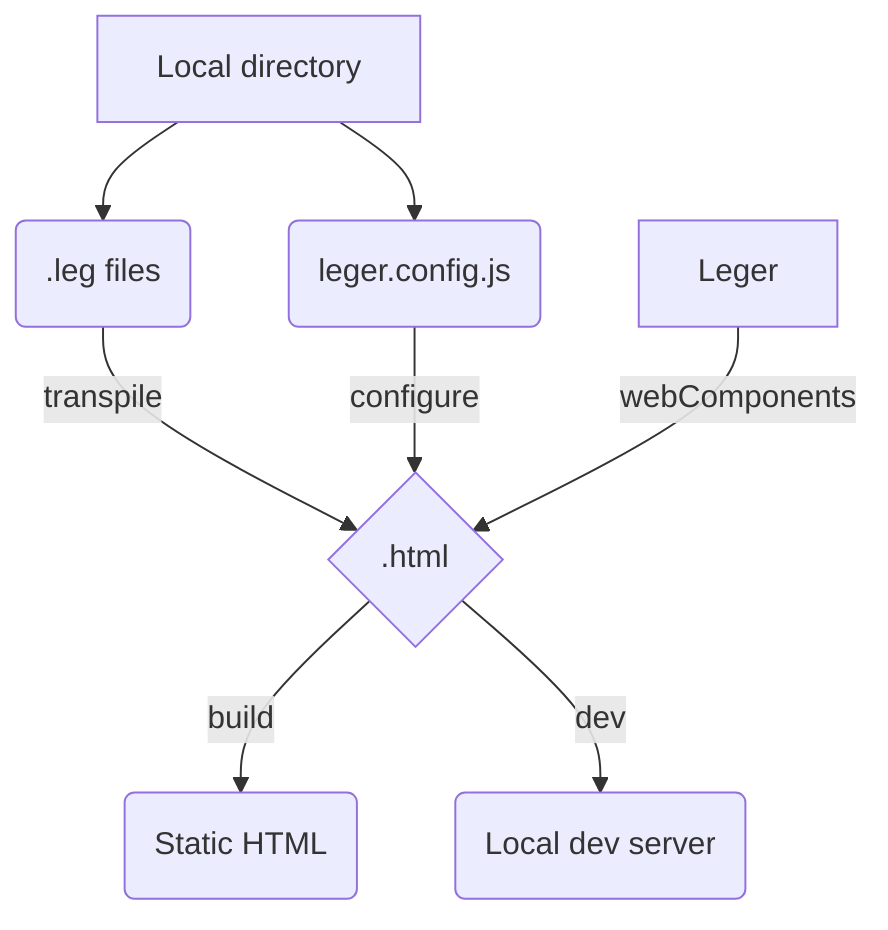

# Léger

Lightweight Static Site Generator (SSG) built with Svelte &amp; Vite, shipped with no dependencies.


## Target transpiling pipeline



## Todo

- [ ] Favicon support
  - [ ] Need to support local assets copied into build folder
- [ ] more components
  - [ ] Header
  - [ ] Title
  - [ ] Image
  - [ ] Footer
  - [ ] Button
- [ ] markdown support
- [ ] custom svelte support
- [ ] mixin support
- [ ] better parsing
  - [ ] allow nested trailing text
- [ ] add cli options (in/out)
  - [ ] from cli
  - [ ] from leger.config.js

## Example `.leg` file

```jade
section(columns="2")
    text(size="large") This is awesome
    text(size="small") ... and this might be too small
button() Sign up
```

## Example full `.leg` file with metadata

```jade
---
title: My own leger website
description: You can write here some custom description
siteName: My Own Site with Leger
---

text(size=xl) Hello, Leger
```
